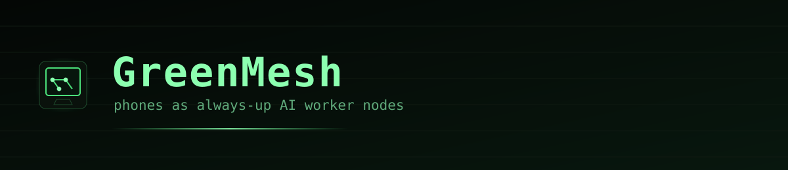
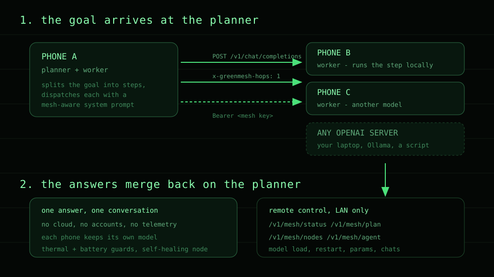
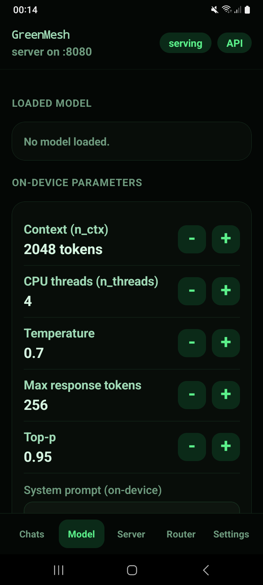
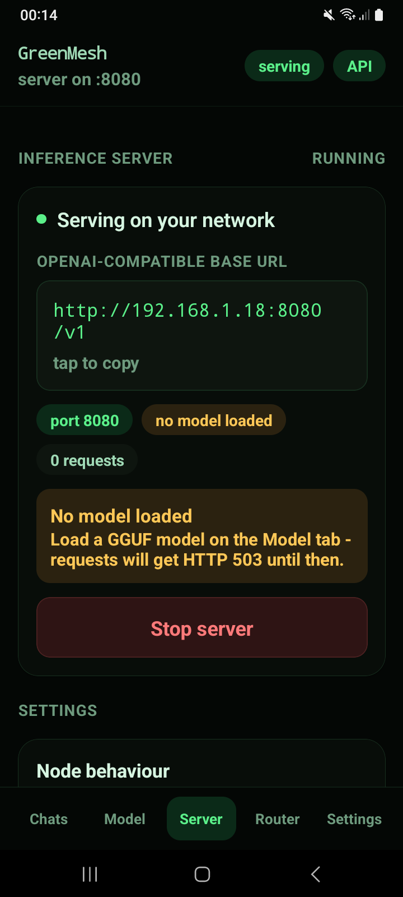
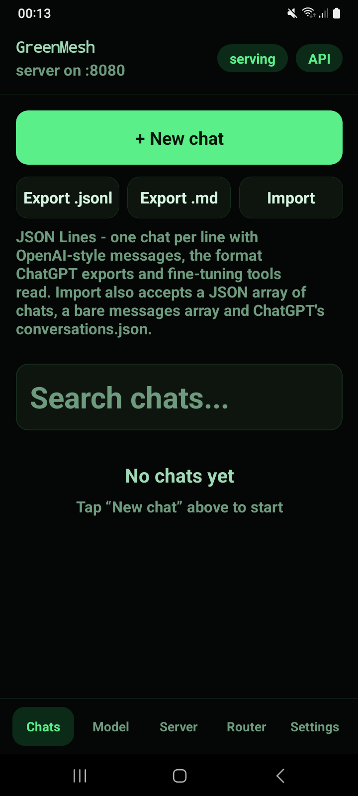
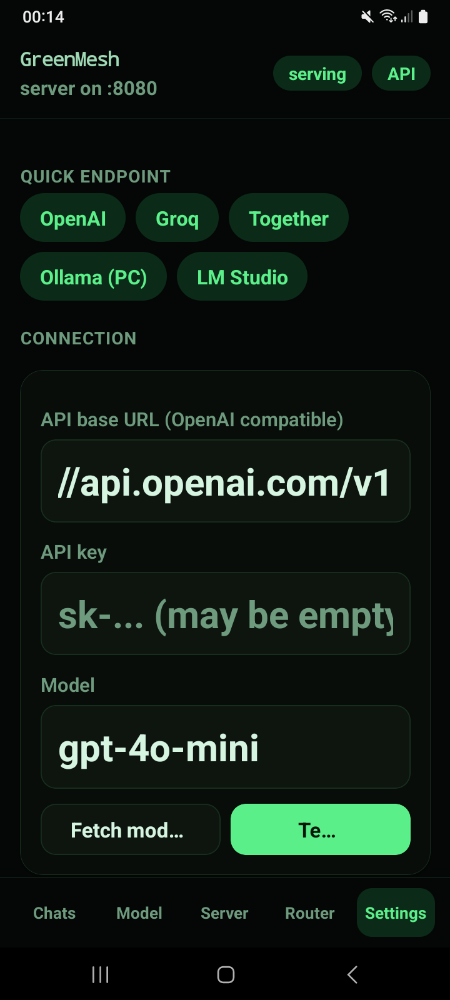

[](LICENSE)
[](#quick-start)
[](#models)
[](#the-http-api)
[](#contributing)

Turn an Android phone into an AI worker node. GreenMesh runs models **on the phone**,
serves an **OpenAI-compatible API** on your local network, and lets several phones
**share a job**: one plans, the others execute, the results come back merged.

No cloud account. No telemetry. Nothing leaves the phone unless you point it somewhere.

---

## Why this exists

A phone is a computer with a battery, a screen, a microphone, a camera and a
network connection, sitting switched on most of the day. GreenMesh treats it that way:
a node that can be given work over HTTP and will keep serving it through screen-off,
reboots, and app updates, without cooking itself or draining the battery flat.

Two things follow from that, and they are the whole point:

- **Your data stays put.** The model runs on the device it is chatting on.
- **Capacity is additive.** Five phones in a drawer are five workers, each with its
  own model, sharing one job.

## How the mesh works



1. **A goal arrives at the planner.** Any phone can plan. It uses its own on-device
   model to split the goal into ordered steps.
2. **Each step is dispatched to a worker** over plain HTTP, with a system prompt that
   tells the receiving node it is part of a mesh, so it answers in that role rather
   than as a chatbot. A hop counter (`x-greenmesh-hops`) stops a step bouncing back
   to the node that sent it.
3. **Workers run their step locally**, on their own model, and return text.
4. **The planner merges the results** into one answer in the original conversation.

Any OpenAI-compatible server can join in as a worker — a laptop running Ollama, a
machine running LM Studio, a mock server in a test suite. Discovery sweeps the local
network, health-checks what it finds, and only keeps nodes that answer.


## Screenshots

**Chats** — a conversation on the device


**Model** — downloading and loading GGUF models



**Server** — the OpenAI-compatible endpoint



**Router** — the mesh: nodes, planning, jobs



**Settings** — connection, speech, diagnostics




## Features

- **On-device chat** — GGUF models you download in the app: Qwen3, LFM2.5, Nemotron
  and anything else on Hugging Face. Vision models take a photo as input.
- **An always-up node** — foreground service, self-healing after reboot or an app
  update, an alarm-based watchdog that revives the listener, and a persistent
  notification so Android does not quietly kill it.
- **It will not cook your phone** — the CPU lock is held *only* while a job is
  running, and above thermal or battery thresholds the node stops accepting work and
  says so in `/health` instead of degrading silently.
- **Dictation** — Whisper on the device. Tap to start, tap to stop, or hold to talk.
- **Spoken replies** — the phone's own voice engine, with Piper voices downloadable
  for later (see the note under Limitations).
- **Chat import/export** — JSON Lines (one conversation per line), plus ChatGPT
  export and plain `messages` arrays on import, with de-duplication.
- **A real remote control API** — drive a node from anywhere on the LAN.
- **Diagnostics** — a verbose event log of every model load, download, dictation and
  mesh call, so a node you cannot physically reach can still be debugged.

## Quick start

Full detail in [INSTALL.md](INSTALL.md). The short version:

1. Install the APK from the [releases page](../../releases).
2. Open it, allow notifications (that is what keeps the node alive).
3. **Model** tab: pick one (Qwen3 0.6B is the quickest to try), download, load.
4. **Chats** tab: start typing. Or hold **Mic** to talk.

Prefer your own computer's model? **Settings → Connection** takes any
OpenAI-compatible endpoint and key.

To build a mesh: do that on a second phone, put both on the same Wi-Fi, open
**Router** on one of them, switch the planner on, and press **Scan**. Then give it a
goal.

## The HTTP API

Every node exposes the same endpoints, protected by a key shown on the **Server** tab.
Every fresh install starts with one shared default key so phones trust each other out
of the box — change it on any network that is not exclusively yours.

| Method | Path | What it does |
|---|---|---|
| `GET` | `/health` | Liveness, loaded model, thermal state, queue depth |
| `POST` | `/v1/chat/completions` | OpenAI-compatible completions, streaming or not |
| `GET` | `/v1/models` | What this node is serving |
| `GET` | `/v1/mesh/status` | Node, model, live request and completion counters |
| `POST` | `/v1/mesh/scan` | Sweep the LAN for OpenAI servers and health-check them |
| `POST` | `/v1/mesh/nodes` | Test and add a worker; `DELETE` the same path drops one |
| `POST` | `/v1/mesh/plan` | **Give a goal and have the mesh execute it** |
| `POST` | `/v1/mesh/agent` | Multi-round job with tool calls |
| `POST` | `/v1/mesh/model/load` | Load a downloaded model (remote model swap) |
| `POST` | `/v1/mesh/server/restart` | Restart the listener, optionally on a new port |
| `POST` | `/v1/mesh/params` | Change temperature, context, threads and friends |
| `GET` | `/v1/mesh/chats` | Read, export and import conversations |

```bash
curl -H "Authorization: Bearer $KEY" http://<phone-ip>:8080/v1/mesh/status
curl -H "Authorization: Bearer $KEY" -X POST http://<phone-ip>:8080/v1/mesh/plan \
     -d '{"goal":"Name two things a phone mesh is good for, one line each"}'
```

## Models the app can download (publisher's license applies)

**Nothing is bundled, and nothing is limited to a list.** The Model tab ships with
shortcuts for convenience, but it also accepts:

- **any GGUF repository by `owner/name`** — the app reads that repository's own file
  list and picks a sensible quantisation for you, or you can name the exact file;
- **any direct download URL** ending in a `.gguf`;
- any **Whisper GGML** model or **Piper voice** the same way, wherever it is hosted.

The shortcuts are therefore suggestions, not the set:

| Shortcut | Roughly | Good for |
|---|---|---|
| Qwen3 0.6B | ~380 MB | trying the app out, and planning on a slow phone |
| LFM2.5 1.2B | ~800 MB | a better planner without much size |
| Qwen3 4B / 8B | 2.5–5 GB | real answers, if the phone has room |
| Qwen VL / InternVL | 3–6 GB | photos: "what is in this picture?" |
| Whisper | ~57–150 MB | dictation |
| Piper voices | ~60 MB each | speech (see Limitations) |

Because of that, a model released after this app was built will work in it. The
licence you accept is between you and the publisher you download from — the app only
fetches the bytes you asked for onto your own device.

## Limitations, honestly

- **A small planner gives coarse plans.** A 0.6B model sometimes returns one big step
  instead of splitting a goal. Put your best model on whichever phone plans.
- **Some models leak thinking preambles** ("Okay, the user wants…") into answers.
  That is the model, not the transport.
- **Piper voice playback is not available in this build** — voices download and are
  listed, but the on-device synthesis engine cannot initialise on this React Native
  version, so replies use the phone's own voice. The app reports this rather than
  failing silently.
- **Aggressive battery managers fight it.** Xiaomi/MIUI needs its autostart whitelist
  switched on per app or a node will not come back after a reboot. Settings points at
  the relevant screens. A *Force stop* still wins — that is Android, not the app.
- **The default mesh key is public** in this repository. It is a convenience, not a
  secret.

## Verify the download

The APK is signed by this project, not by a store. Its certificate fingerprint:

```
SHA-256  f718cd77af19b71acd5cd404273d74e9858c8bbbedd529b1c3879d54a5f6bc7b
```

```bash
apksigner verify --print-certs GreenMesh-1.2.0-arm64.apk
```

If the digest differs, the file did not come from here — do not install it.

## Privacy

Short version: no analytics, no accounts, no server of ours. The microphone is used
only while you are dictating, on the device. Details in [PRIVACY.md](PRIVACY.md).

## Contributing

Issues and pull requests are welcome. Before opening a PR, run the release check —
it catches the things that should never reach a public repo:

```bash
bash scripts/check-release.sh
```

## Licence and credits

[MIT](LICENSE). Third-party licences, and the terms of the models this app can
download, are in [THIRD_PARTY.md](THIRD_PARTY.md) and [NOTICE](NOTICE).

GreenMesh is not affiliated with, endorsed by or sponsored by any model publisher or
library named above; their names are used only to say what this software works with.
